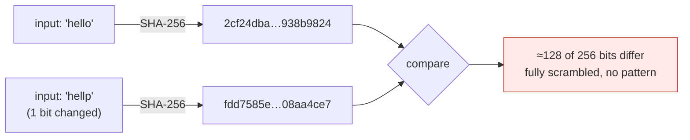

# 1 · Hash Functions — the tamper-evidence layer

> [!info] Navigation
> [[🏠 Home]] · next → [[2 - Merkle Trees]] · code → [[Crypto.cs]]

## The math

A cryptographic hash is a function

$$
H : \{0,1\}^{*} \longrightarrow \{0,1\}^{n}
$$

mapping any-length input to a fixed $n$-bit output (SHA-256 → $n = 256$). Three
properties define "cryptographic":

> [!note] The three security properties
> - **Pre-image resistance** — given $y$, finding any $x$ with $H(x)=y$ costs $\sim 2^{n}$. *You cannot invert it.*
> - **Second pre-image resistance** — given $x$, finding $x' \neq x$ with $H(x')=H(x)$ costs $\sim 2^{n}$.
> - **Collision resistance** — finding *any* $x \neq x'$ with $H(x)=H(x')$ costs $\sim 2^{n/2}$ (the **birthday bound**). For SHA-256 that is $2^{128}$ — infeasible.

The property you can *feel* is the **avalanche effect**: flipping one input bit
flips about half the output bits, with no correlation to the change:

$$
\Pr\big[\,\text{output bit } i \text{ flips} \mid \text{one input bit flipped}\,\big] \approx \tfrac{1}{2}, \quad \forall i
$$

This is the entire basis of tamper-detection: there is no "small" edit.

## Visual — the avalanche effect

Two inputs differing by one letter (`o` → `p`, i.e. `0x6F` → `0x70`, a single
bit) produce completely unrelated digests:



> [!example] Verified MiniChain output
> ```
> SHA256("hello") = 2cf24dba5fb0a30e26e83b2ac5b9e29e1b161e5c1fa7425e73043362938b9824
> SHA256("hellp") = fdd7585e08c4e2afd71dcabdb4636c89d557a3f42db9e2040c8bbd1708aa4ce7
> ```
> Neighbors in input space, maximally distant in output space.

## Why the chain needs this

Change one satoshi in one transaction and *every* hash from that point forward
is unrecognizably different — which is exactly what makes the [[4 - Proof of Work|hash-link between blocks]]
tamper-evident, and what the [[2 - Merkle Trees|Merkle root]] relies on.

## The C#

```csharp
public static byte[] Sha256(byte[] data) => SHA256.HashData(data);

public static string Sha256Hex(string text)
    => ToHex(Sha256(Encoding.UTF8.GetBytes(text)));

// Bitcoin's "double hash" hardens against length-extension attacks:
public static byte[] DoubleSha256(byte[] data) => Sha256(Sha256(data));
```

The `LeadingZeroBits` helper — used later by [[4 - Proof of Work]] — counts the
high-order zero bits of a digest:

```csharp
public static int LeadingZeroBits(byte[] hash)
{
    int count = 0;
    foreach (var b in hash)
    {
        if (b == 0) { count += 8; continue; }
        for (int bit = 7; bit >= 0; bit--)
            if ((b & (1 << bit)) == 0) count++; else return count;
    }
    return count;
}
```

Full file: [[Crypto.cs]].
