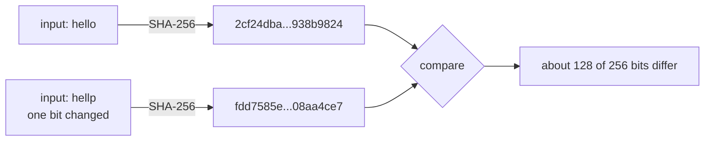

# 1 · Hash Functions — the tamper-evidence layer

> [!info] Navigation
> [[🏠 Home]] · next → [[2 - Merkle Trees]] · code → [[Crypto.cs]] · glossary → [[Glossary]]

## 0. One-sentence intuition

A cryptographic hash turns arbitrary bytes into a fixed-size digest such that changing the bytes is easy to detect and hard to hide.

## 1. Problem being solved

A blockchain node needs cheap answers to two questions:

1. Did this byte string change?
2. Can a short value commit to a much larger object?

A cryptographic hash is the primitive that makes both possible. The block header stores hashes, not full historical state. Merkle roots store one digest, not every transaction. A hash-linked chain stores one previous-header digest, not a full recursive transcript.

The basic type is

$$
H : \{0,1\}^{*} \rightarrow \{0,1\}^{n},
$$

where SHA-256 has $n=256$.

> [!warning] Hashing is not encryption
> A hash commitment is not confidentiality. Everyone can hash candidate messages and compare. If the message space is small, the commitment leaks by brute force.

## 2. Formal definition

Security definitions are normally stated for a family of hash functions $\mathcal H$ and an adversary $A$ running in time at most $t$. For a fixed deployed hash such as SHA-256, we treat the function as one sampled member and rely on public cryptanalysis plus conservative security margins.

### Preimage resistance

Sample $x \leftarrow \{0,1\}^{\ell}$ and set $y=H(x)$. A hash is $(t,\epsilon)$-preimage-resistant if every adversary $A$ running in time $t$ satisfies

$$
\Pr[H(A(y)) = y] \le \epsilon.
$$

For an ideal $n$-bit hash, generic preimage search costs about $2^n$ trials.

### Second-preimage resistance

Sample $x$. The adversary receives $x$ and wins if it outputs $x' \ne x$ with the same digest:

$$
\Pr[x' \leftarrow A(x): x' \ne x \land H(x')=H(x)] \le \epsilon.
$$

For an ideal $n$-bit hash and a fixed target $x$, generic second-preimage search also costs about $2^n$ trials.

### Collision resistance

Collision resistance uses a different game.

```text
Collision experiment Exp_coll(A, H):
    1. Challenger fixes or samples H.
    2. A outputs two byte strings (x, x').
    3. A wins iff x != x' and H(x) = H(x').
```

The advantage is

$$
\mathrm{Adv}^{coll}_{H}(A)=
\Pr[(x,x')\leftarrow A: x\ne x' \land H(x)=H(x')].
$$

For an ideal $n$-bit hash, generic collision search costs about $2^{n/2}$ evaluations, not $2^n$.

## 3. Birthday bound

If $q$ independent hash outputs are modeled as uniform points in $\{0,1\}^n$, the probability of no collision is

$$
\prod_{i=0}^{q-1}\left(1-\frac{i}{2^n}\right).
$$

Using $\ln(1-u)\approx -u$ for small $u$,

$$
\Pr[\text{no collision}]
\approx
\exp\left(-\sum_{i=0}^{q-1}\frac{i}{2^n}\right)
=
\exp\left(-\frac{q(q-1)}{2^{n+1}}\right).
$$

Therefore

$$
\Pr[\text{collision}]
\approx
1-\exp\left(-\frac{q(q-1)}{2^{n+1}}\right).
$$

The exponent becomes constant when $q^2/2^{n+1}\approx 1$, so

$$
q\approx 2^{n/2}.
$$

For SHA-256, this is the usual $2^{128}$ generic collision-security level.

## 4. Construction taxonomy

A blockchain note should not collapse all hashing vocabulary into one word.

| Term | Meaning | Blockchain relevance |
|---|---|---|
| Hash function | Full map $\{0,1\}^*\to\{0,1\}^n$ | Hash transaction bytes, block headers, public keys. |
| Compression function | Fixed-input primitive $f:\{0,1\}^{c}\times\{0,1\}^{b}\to\{0,1\}^{c}$ | Used inside Merkle-Damgård hashes such as SHA-256. |
| Merkle-Damgård | Iterate compression over padded blocks | SHA-256/SHA-512 family structure. |
| Sponge | Absorb/squeeze using a permutation and capacity/rate split | SHA-3/Keccak style construction. |
| Random oracle model | Idealized public random function | Proof model; not an implementation. |
| SHA-256 | Concrete NIST standard hash | Bitcoin block-header and transaction hashing. |

### Length-extension attack

Merkle-Damgård hashes expose a digest that is essentially the final internal chaining value. If an attacker knows $H(m)$ and the length of $m$, it can often compute

$$
H(m \Vert \mathrm{pad}(m) \Vert m')
$$

without knowing $m$ itself. This does not invert the hash; it extends a valid digest computation from the known final state.

Bitcoin frequently uses double SHA-256:

$$
\mathrm{HASH256}(m)=\mathrm{SHA256}(\mathrm{SHA256}(m)).
$$

The outer hash hashes a fixed 32-byte value, so the attacker does not get a useful internal state for extending the original message. Double hashing is not a universal design pattern; modern protocols often prefer domain-separated hashes, HMAC, or sponge-based constructions where appropriate.

### Domain separation

The same hash should not mean different things in different contexts. A disciplined design hashes tagged data:

$$
H(\texttt{"txid"}\Vert tx),\qquad
H(\texttt{"block-header"}\Vert header),\qquad
H(\texttt{"merkle-leaf"}\Vert x).
$$

Without domain separation, bytes valid in one protocol position can sometimes be reinterpreted in another.

## 5. Security assumptions and threat model

Adversary capabilities:

- Can read all public chain data.
- Can choose malicious transactions and block-like byte strings.
- Can grind many candidate inputs.
- Can exploit non-canonical serialization or byte-order ambiguity.
- Can control some hash power in proof-of-work.

Adversary cannot, under the model:

- Find preimages, second preimages, or collisions faster than the assumed bounds.
- Distinguish practical hash outputs from uniform random strings well enough to bias consensus-critical outcomes.
- Bypass canonical byte encodings accepted by all honest nodes.

> [!danger] If this assumption fails
> If collision resistance fails, Merkle roots and block hashes stop being binding commitments. If preimage resistance fails, hash commitments can leak or be opened maliciously. If serialization is ambiguous, honest nodes may hash different bytes while believing they hash the same object.

## 6. Theorem / proof sketch

### Collision resistance implies second-preimage resistance for sampled targets

Suppose an adversary $A$ finds, for a random target $x$, a distinct $x'$ such that $H(x')=H(x)$ with non-negligible probability. Then a collision-finding adversary can sample $x$, run $A(x)$, and output $(x,x')$. Thus second-preimage attacks on randomly sampled targets imply collision attacks.

The reverse is not generally true. Collision resistance is stronger in a different sense: a collision attacker may choose both messages adaptively. A second-preimage attacker is tied to a fixed target.

### Hash-linked tamper evidence

Let block $B_i$ contain the previous hash

$$
h_{i-1}=H(B_{i-1}).
$$

Claim: if an adversary modifies $B_j$ but keeps all later stored hashes unchanged, it must find a collision in $H$.

Proof sketch. Let $B_j'\ne B_j$ be the modified block. If block $B_{j+1}$ still stores the old pointer $h_j=H(B_j)$ and remains valid without recomputing, then the modified block must satisfy

$$
H(B_j') = H(B_j).
$$

This is a collision. If the adversary instead changes $h_j$ inside $B_{j+1}$, then $H(B_{j+1})$ changes and the same argument moves one block forward. In proof-of-work systems, changing later blocks is possible only by recomputing valid proof of work and overtaking the honest chain.

## 7. Worked numerical example

MiniChain demonstrates the avalanche effect:

```text
SHA256("hello") = 2cf24dba5fb0a30e26e83b2ac5b9e29e1b161e5c1fa7425e73043362938b9824
SHA256("hellp") = fdd7585e08c4e2afd71dcabdb4636c89d557a3f42db9e2040c8bbd1708aa4ce7
```

The inputs differ by one bit in ASCII (`o = 0x6f`, `p = 0x70`). About half the output bits change, as expected for a well-mixed 256-bit digest.

## 8. ASCII diagram

```text
Input space: arbitrary length                     Output space: fixed 256 bits

"hello"  --------------+
                       | SHA-256
"hellp"  --------------+

hello -> 2cf24dba5f...938b9824
hellp -> fdd7585e08...08aa4ce7

One-bit input change
        |
        v
about 128 output bits flip
```

```text
Tamper cascade

Block 0                 Block 1                 Block 2
+---------+             +---------+             +---------+
| data_0  |             | data_1  |             | data_2  |
| hash H0 | ----------> | prev H0 | ----------> | prev H1 |
+---------+             | hash H1 |             | hash H2 |
                        +---------+             +---------+

Modify data_1
    |
    v
H1 changes
    |
    v
Block 2.prev != new H1
    |
    v
chain breaks unless later blocks are recomputed
```

## 9. Mermaid diagram



## 10. C# implementation link

```csharp
public static byte[] Sha256(byte[] data) => SHA256.HashData(data);

public static string Sha256Hex(string text)
    => ToHex(Sha256(Encoding.UTF8.GetBytes(text)));

public static byte[] DoubleSha256(byte[] data) => Sha256(Sha256(data));
```

The `LeadingZeroBits` helper used by [[4 - Proof of Work]] counts high-order zero bits of a digest:

```csharp
public static int LeadingZeroBits(byte[] hash)
{
    int count = 0;
    foreach (var b in hash)
    {
        if (b == 0) { count += 8; continue; }
        for (int bit = 7; bit >= 0; bit--)
            if ((b & (1 << bit)) == 0) count++; else return count;
    }
    return count;
}
```

Full file: [[Crypto.cs]].

## 11. Edge cases and attacks

- **Canonical serialization:** every node must hash exactly the same byte sequence. Equivalent JSON, reordered maps, omitted default fields, or platform-dependent encodings are consensus hazards.
- **Endian traps:** Bitcoin stores many hashes internally in little-endian byte order but displays them conventionally reversed in many interfaces. Hash the bytes, not the display string.
- **Domain confusion:** use prefixes or tags when the same hash function commits to different object types.
- **Transaction ID malleability:** if a transaction identifier includes mutable witness/signature bytes, third parties may change the ID without changing the economic effect. SegWit-style designs separate witness commitments from legacy transaction IDs.
- **Small-message commitments:** hashing `yes/no`, a salary band, or a low-entropy secret does not hide it. Salt or use a proper commitment scheme.
- **Randomness language:** hash outputs are deterministic. We model them as pseudorandom or random-oracle-like only relative to computationally bounded adversaries.

## 12. What MiniChain simplifies

MiniChain correctly demonstrates SHA-256, double hashing, leading-zero counting, and hash-linked tamper evidence. It deliberately omits production-grade details:

- No consensus-critical binary serialization format.
- No network-level byte-order tests.
- No domain-separated tagged hashes.
- No witness/transaction-ID separation.
- No commitment salt for low-entropy data.
- No formal test vectors beyond simple demonstration strings.

## 13. References

- NIST, *FIPS 180-4: Secure Hash Standard*, 2015.
- NIST, *FIPS 202: SHA-3 Standard*, 2015.
- Satoshi Nakamoto, *Bitcoin: A Peer-to-Peer Electronic Cash System*, 2008.
- Mihir Bellare and Phillip Rogaway, *Random Oracles are Practical*, 1993.
- Jonathan Katz and Yehuda Lindell, *Introduction to Modern Cryptography*.
- Bitcoin Developer Reference, block headers, Merkle roots, byte order, and target fields.
