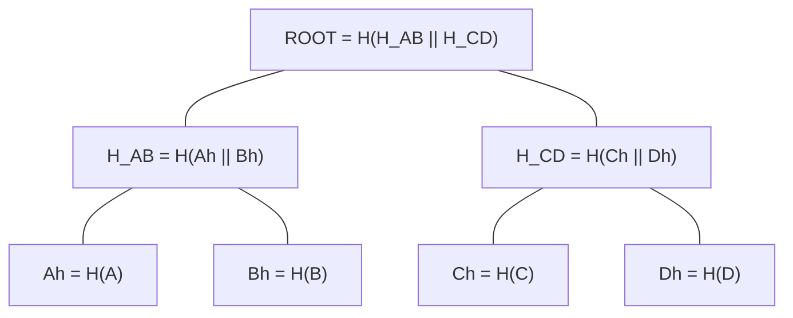

# 2 · Merkle Trees — one hash commits to many things

> [!info] Navigation
> [[🏠 Home]] · prev → [[1 - Hash Functions]] · next → [[3 - Digital Signatures]] · code → [[MerkleTree.cs]] · glossary → [[Glossary]]

## 0. One-sentence intuition

A Merkle tree turns a list of many items into one root hash while preserving short, verifiable inclusion proofs.

## 1. Problem being solved

A block may contain thousands of transactions. A light verifier should not need the entire block to check whether one transaction is included. The verifier needs:

1. a short commitment to the ordered transaction list;
2. a short witness proving one element is under that commitment;
3. a binding guarantee: the committer cannot later open the same root to a different ordered list.

Merkle trees solve membership efficiently. They do not automatically solve non-membership unless the committed structure is sorted or keyed.

## 2. Formal definition

For an ordered list $X=[x_0,\ldots,x_{N-1}]$, define a Merkle commitment

$$
M(X)=R,
$$

where $R$ is the root. A rigorous binary construction uses domain separation:

$$
L_i = H(\texttt{0x00}\Vert x_i)
$$

for leaves, and

$$
N_{a,b}=H(\texttt{0x01}\Vert a\Vert b)
$$

for internal nodes.

The prefixes prevent a leaf byte string from being reinterpreted as an internal-node pair. MiniChain omits these prefixes for simplicity; production commitment schemes should not.

### Proof object

A membership proof for item $x$ at index $i$ is

$$
\pi = [(s_0, dir_0),(s_1, dir_1),\ldots,(s_{h-1},dir_{h-1})],
$$

where $s_j$ is the sibling hash at height $j$ and $dir_j\in\{\mathsf{LEFT},\mathsf{RIGHT}\}$ tells whether the sibling is to the left or right of the running hash.

### Verification algorithm

```text
verify(x, index, proof, root):
    h = H(0x00 || x)
    for each (sibling, direction) in proof:
        if direction == LEFT:
            h = H(0x01 || sibling || h)
        else:
            h = H(0x01 || h || sibling)
    return h == root
```

The index is consensus-relevant because the tree commits to order, not just set membership.

## 3. Security assumptions and threat model

Adversary capabilities:

- Can choose malicious transactions and duplicate transaction IDs.
- Can present arbitrary sibling paths.
- Can exploit ambiguous serialization or missing domain separation.
- Can try to make two different ordered lists share one root.

Adversary cannot, under the model:

- Find collisions in the hash function.
- Make honest nodes disagree about leaf order or byte encoding.
- Forge a root accepted by the block header without also satisfying the enclosing consensus rules.

> [!danger] If this assumption fails
> If collision resistance fails, a Merkle root is no longer a binding commitment. A block could commit to one transaction list for one verifier and another list for another verifier.

## 4. Core construction

For a power-of-two list, pair leaves and hash upward until one hash remains. For non-powers of two, systems must define exact padding rules. Bitcoin duplicates the final hash at a level when that level has odd length. Other systems use default empty nodes, unbalanced trees, or generalized Merkle accumulators.

```text
level 0: L0  L1  L2  L3
level 1: H01     H23
level 2: Root
```

MiniChain follows the pedagogical Bitcoin-style odd-count rule:

```text
if level has odd count:
    right = left for the final pair
```

This rule is simple but creates a known caveat: duplicate leaves can lead to structurally ambiguous trees unless duplicate transaction IDs or mutated trees are explicitly detected.

## 5. Complexity

| Operation | Full list | Merkle tree |
|---|---:|---:|
| Store all transactions | $O(N)$ | $O(N)$ builder, $O(1)$ root commitment |
| Membership proof size | $O(N)$ | $O(\log N)$ |
| Verification | $O(N)$ | $O(\log N)$ |
| Update one leaf | $O(N)$ naive | $O(\log N)$ with stored tree |
| Append-only batch rebuild | $O(N)$ | implementation-dependent |

The root is constant size: 32 bytes for SHA-256. The proof grows logarithmically.

## 6. Theorem / proof sketch

### Binding commitment theorem

If $H$ is collision-resistant and the tree encoding is unambiguous, then the Merkle root binds the committer to one ordered leaf list.

Proof sketch. Suppose two different ordered lists $X\ne X'$ produce the same root. Compare their two trees from the root downward. At the first node where child tuples differ but the parent hash is equal, we have

$$
H(\texttt{0x01}\Vert a\Vert b)=H(\texttt{0x01}\Vert a'\Vert b')
$$

with $(a,b)\ne(a',b')$, or at a leaf

$$
H(\texttt{0x00}\Vert x)=H(\texttt{0x00}\Vert x')
$$

with $x\ne x'$. Either case is a collision in the encoded input to $H$. Therefore any successful equivocation yields a hash collision.

## 7. Worked example

For four transactions $A,B,C,D$:

$$
\begin{aligned}
A_h &= H(A), & B_h &= H(B), & C_h &= H(C), & D_h &= H(D),\\
H_{AB} &= H(A_h\Vert B_h), & H_{CD} &= H(C_h\Vert D_h),\\
R &= H(H_{AB}\Vert H_{CD}).
\end{aligned}
$$

A proof for $C$ supplies $D_h$ and $H_{AB}$. The verifier recomputes:

$$
C_h=H(C),\qquad
H_{CD}'=H(C_h\Vert D_h),\qquad
R'=H(H_{AB}\Vert H_{CD}').
$$

Accept iff $R'=R$.

## 8. ASCII diagram

```text
Merkle tree for 4 transactions

                  Root = H(HAB || HCD)
                         /        \
                        /          \
             HAB = H(Ah || Bh)    HCD = H(Ch || Dh)
                 /      \             /      \
              Ah=H(A)  Bh=H(B)     Ch=H(C)  Dh=H(D)
```

```text
Proof that C is included

Known by verifier:
    C
    Root

Proof supplied:
    Dh      sibling on RIGHT
    HAB     uncle on LEFT

Recompute:
    Ch    = H(C)
    HCD   = H(Ch || Dh)
    Root' = H(HAB || HCD)

Accept iff Root' == Root
```

## 9. Mermaid diagram



## 10. C# implementation link

Building the root, using MiniChain's simplified non-domain-separated leaf and node hashes:

```csharp
public static string Root(IReadOnlyList<string> leaves)
{
    if (leaves.Count == 0) return Crypto.Sha256Hex("");
    var level = leaves.Select(Crypto.Sha256Hex).ToList();
    while (level.Count > 1)
    {
        var next = new List<string>();
        for (int i = 0; i < level.Count; i += 2)
        {
            string left  = level[i];
            string right = (i + 1 < level.Count) ? level[i + 1] : left;
            next.Add(Crypto.Sha256Hex(left + right));
        }
        level = next;
    }
    return level[0];
}
```

Verification replays the path. Order matters because $H(a\Vert b)$ and $H(b\Vert a)$ are different inputs:

```csharp
public static string VerifyProof(string leaf, List<ProofStep> proof)
{
    string running = Crypto.Sha256Hex(leaf);
    foreach (var step in proof)
        running = step.IsRight ? Crypto.Sha256Hex(running + step.Hash)
                               : Crypto.Sha256Hex(step.Hash + running);
    return running;
}
```

Full file: [[MerkleTree.cs]]. The root is committed into the [[4 - Proof of Work|block header]].

## 11. Edge cases and attacks

### Non-membership

A basic unsorted Merkle tree proves inclusion, not absence. To prove absence, the structure needs more order:

- **Sorted Merkle tree:** prove neighboring leaves around the missing key.
- **Sparse Merkle tree:** commit to a key-value map over a huge keyspace, often $2^{256}$ possible keys.
- **Merkle Patricia Trie:** compresses paths and supports authenticated key-value state, as in Ethereum-style state commitments.

### Sparse Merkle trees

For keys $k\in\{0,1\}^{256}$, a sparse tree has depth 256. Empty subtrees use deterministic default hashes:

$$
D_0=H(\texttt{empty}),\qquad D_{i+1}=H(D_i\Vert D_i).
$$

A membership or non-membership proof has at most 256 sibling hashes, so the asymptotic bound is

$$
O(\log 2^{256})=O(256)=O(1)
$$

for a fixed key size, though the constant is substantial.

### Bitcoin odd-leaf duplication caveat

Bitcoin's Merkle construction duplicates the final hash at odd levels. This is consensus behavior, but implementers must detect mutation ambiguity caused by duplicated transaction IDs. A robust verifier should not treat structurally different trees with duplicated leaves as harmless if the transaction multiset is supposed to be unique.

### Serialization hazards

Merkle security assumes the verifier hashes the same bytes the committer hashed. Hashing display strings, hex encodings, JSON objects, or platform-native structs is a common bug pattern.

## 12. What MiniChain simplifies

MiniChain demonstrates membership proofs and root recomputation. It does not implement:

- domain-separated leaf/internal-node prefixes;
- binary transaction serialization;
- duplicate-TXID mutation detection;
- sparse tree non-membership proofs;
- authenticated state tries;
- append-optimized persistent tree storage;
- proof size accounting in bytes.

## 13. References

- Ralph C. Merkle, *Protocols for Public Key Cryptosystems*, 1980.
- Satoshi Nakamoto, *Bitcoin: A Peer-to-Peer Electronic Cash System*, 2008.
- Bitcoin Developer Reference, Merkle tree construction and block headers.
- Ethereum Yellow Paper, world state and Merkle Patricia trie commitment.
- Crosby and Wallach, *Efficient Data Structures for Tamper-Evident Logging*, 2009.
