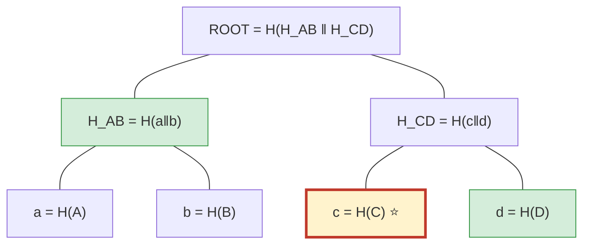

# 2 · Merkle Trees — one hash commits to many things

> [!info] Navigation
> [[🏠 Home]] · prev → [[1 - Hash Functions]] · next → [[3 - Digital Signatures]] · code → [[MerkleTree.cs]]

## The math

A block has $N$ transactions. We want a **single** value that (a) commits to all
of them and (b) lets someone prove one transaction is included without seeing
the other $N-1$. Define leaves $L_i = H(\text{tx}_i)$ and pair-and-hash upward:

$$
\text{parent} = H(\text{left} \,\Vert\, \text{right})
$$

until one value remains — the **Merkle root** $R$. The tree has height
$\lceil \log_2 N \rceil$, so a **membership proof** is just the $\log_2 N$ sibling
hashes on the path from your leaf to the root.

> [!note] Why it scales
> - Verifier cost: $O(\log N)$ hashes and $O(\log N)$ data — **not** $O(N)$.
> - Forging a proof needs a hash collision ($\approx 2^{128}$).
> - A phone wallet verifies a payment with $\log_2 N \approx 12$ hashes instead of storing ~600 GB.

## Visual — a 4-leaf tree and a membership proof

Proving `tx-C` is in the block $\{A,B,C,D\}$:



The **proof for C** is the two green nodes: $[\,d\ (\text{sibling, right}),\ H_{AB}\ (\text{uncle, left})\,]$. The verifier recomputes bottom-up:

$$
\begin{aligned}
c    &= H(C) &&\text{(verifier hashes C itself)}\\
H_{CD}' &= H(c \,\Vert\, d) &&\text{(}d\text{ supplied, on the right)}\\
R'   &= H(H_{AB} \,\Vert\, H_{CD}') &&\text{(}H_{AB}\text{ supplied, on the left)}\\
&\text{accept} \iff R' = R
\end{aligned}
$$

> [!example] Verified MiniChain output
> ```
> Merkle root of [A,B,C,D] = 42fe5be41eb4f21b5936d850…
> Proof for 'tx-C' has 2 steps; recomputed root matches: True
> ```
> Only **2 hashes** proved membership among 4 items — it would be ~20 for a million.

## The C#

Building the root (note the odd-count rule: duplicate the last node, Bitcoin's convention):

```csharp
public static string Root(IReadOnlyList<string> leaves)
{
    if (leaves.Count == 0) return Crypto.Sha256Hex("");
    var level = leaves.Select(Crypto.Sha256Hex).ToList();     // level 0
    while (level.Count > 1)
    {
        var next = new List<string>();
        for (int i = 0; i < level.Count; i += 2)
        {
            string left  = level[i];
            string right = (i + 1 < level.Count) ? level[i + 1] : left;  // odd → dup
            next.Add(Crypto.Sha256Hex(left + right));
        }
        level = next;
    }
    return level[0];
}
```

Verifying replays the path — order matters because $H(a\Vert b) \neq H(b\Vert a)$:

```csharp
public static string VerifyProof(string leaf, List<ProofStep> proof)
{
    string running = Crypto.Sha256Hex(leaf);
    foreach (var step in proof)
        running = step.IsRight ? Crypto.Sha256Hex(running + step.Hash)
                               : Crypto.Sha256Hex(step.Hash + running);
    return running;   // caller compares to the trusted root
}
```

Full file: [[MerkleTree.cs]]. The root ends up in the [[4 - Proof of Work|block header]] that gets mined.
