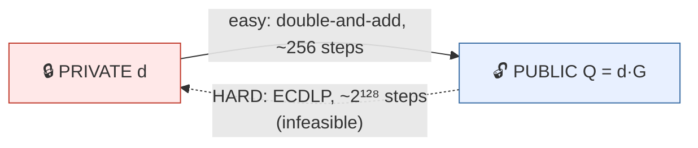

# 3 · Digital Signatures — who authorized this?

> [!info] Navigation
> [[🏠 Home]] · prev → [[2 - Merkle Trees]] · next → [[4 - Proof of Work]] · code → [[Wallet.cs]]

## The math — ECDSA over an elliptic curve

Hashing gives tamper-evidence but says nothing about *authorization*. For that
we need **public-key signatures**. Blockchains use **elliptic curves** because
keys are tiny (32 bytes) for the same security as huge RSA keys.

An elliptic curve over a finite field $\mathbb{F}_p$ is the set of points
$(x,y)$ satisfying, for **secp256k1** (Bitcoin's curve):

$$
y^{2} \equiv x^{3} + 7 \pmod{p}, \qquad p = 2^{256} - 2^{32} - 977
$$

The points, plus a "point at infinity" $\mathcal{O}$, form an **abelian group**
under a chord-and-tangent addition law. Fix a generator $G$ of large prime order
$n$. Then:

> [!note] Keys
> - **Private key**: a random integer $d \in [1, n-1]$.
> - **Public key**: the point $Q = d \cdot G$ (i.e. $G$ added to itself $d$ times).

Security rests on the **Elliptic-Curve Discrete Log Problem**: recovering $d$
from $Q$ and $G$ costs $\sim \sqrt{n} \approx 2^{128}$ — infeasible. So $Q$ is
public while $d$ stays secret.

### Signing and verifying

With message hash $z = H(m)$ and a fresh random nonce $k$:

$$
\begin{aligned}
R = k\cdot G,\quad r &= R.x \bmod n\\
s &= k^{-1}\,(z + r\,d) \bmod n\\
\text{signature} &= (r, s)
\end{aligned}
$$

Verification uses **only** the public key $Q$:

$$
\begin{aligned}
u_1 = z\,s^{-1} \bmod n, &\quad u_2 = r\,s^{-1} \bmod n\\
R' &= u_1\cdot G + u_2\cdot Q\\
\text{accept} &\iff R'.x \bmod n = r
\end{aligned}
$$

The algebra cancels so $R' = R$ **iff** the signer knew $d$ — without ever
transmitting $d$.

> [!warning] The $k$ footgun
> The nonce $k$ must be **unique and secret** per signature. Reusing $k$ across
> two signatures lets anyone solve for $d$ algebraically. This has caused real
> key thefts (e.g. the 2010 PlayStation 3 breach).

## Visual — scalar multiplication is a one-way street



The group's addition law geometrically (chord for $P+Q$, tangent for $2P$),
reflecting the third intersection across the x-axis:

```
        P + Q = R                         2P = R  (tangent at P)
           ●Q                                ╱
          ╱  \                              ● P
        ●P    \                            ╱ \
    ──────────●────── x-axis        ──────●────── x-axis
             ╱ R'                          ╱ R'
     R = reflect(R') across the x-axis — the reflection is what closes the group.
```

> [!example] Verified MiniChain output
> ```
> Signature verifies (untampered):   True
> Signature verifies (tampered msg): False
> ```
> Changing *"Alice pays Bob 10"* → *"...1000"* against the same signature fails.
> The signature is bound to the exact bytes.

## The C#

.NET's `ECDsa` implements the curve math; you work at the key level. (I use NIST
**P-256**, the portable built-in; Bitcoin's **secp256k1** is the same algorithm
with different constants.)

```csharp
public Wallet() => _key = ECDsa.Create(ECCurve.NamedCurves.nistP256);   // generates d, Q

public byte[] Sign(string message)                                       // produces (r,s)
    => _key.SignData(Encoding.UTF8.GetBytes(message), HashAlgorithmName.SHA256);

public static bool Verify(byte[] publicKey, string message, byte[] signature)
{
    using var v = ECDsa.Create();
    v.ImportSubjectPublicKeyInfo(publicKey, out _);                      // only needs Q
    return v.VerifyData(Encoding.UTF8.GetBytes(message),
                        signature, HashAlgorithmName.SHA256);
}
```

A transaction is valid only if the signature verifies **and** the sender address
is genuinely derived from the signing key — see [[Wallet.cs]] and [[5 - Putting It Together]].
