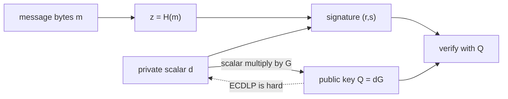

# 3 · Digital Signatures — who authorized this?

> [!info] Navigation
> [[🏠 Home]] · prev → [[2 - Merkle Trees]] · next → [[4 - Proof of Work]] · code → [[Wallet.cs]] · glossary → [[Glossary]]

## 0. One-sentence intuition

A digital signature proves that the holder of a private key authorized exactly these bytes without revealing the private key.

## 1. Problem being solved

Hashing proves data changed. It does not prove who approved the data. In a blockchain, transaction validity needs authorization:

$$
\text{owner of funds} \Rightarrow \text{valid signature over transaction bytes}.
$$

A public-key signature scheme has three algorithms:

$$
(sk,pk)\leftarrow \operatorname{KeyGen},\qquad
\sigma\leftarrow \operatorname{Sign}_{sk}(m),\qquad
\operatorname{Verify}_{pk}(m,\sigma)\in\{0,1\}.
$$

The security target is existential unforgeability under chosen-message attack: after seeing signatures on messages of its choice, an adversary should still be unable to produce a valid signature on a new message.

## 2. Formal curve setting

Bitcoin uses ECDSA over secp256k1. The curve is defined over the prime field $\mathbb F_p$:

$$
y^2 \equiv x^3 + ax + b \pmod p
$$

with

$$
p = 2^{256}-2^{32}-977,
\qquad a=0,
\qquad b=7.
$$

The domain parameters are

$$
T=(p,a,b,G,n,h),
$$

where $G$ is the base point, $n$ is the prime order of $G$, and $h=1$ is the cofactor.

```text
Gx = 79BE667EF9DCBBAC55A06295CE870B07029BFCDB2DCE28D959F2815B16F81798
Gy = 483ADA7726A3C4655DA4FBFC0E1108A8FD17B448A68554199C47D08FFB10D4B8
n  = FFFFFFFFFFFFFFFFFFFFFFFFFFFFFFFEBAAEDCE6AF48A03BBFD25E8CD0364141
h  = 01
```

The private key is a scalar

$$
d\in\{1,\ldots,n-1\},
$$

and the public key is

$$
Q=dG.
$$

The hard problem is the elliptic-curve discrete logarithm problem: given $(G,Q)$, recover $d$.

## 3. Group law and modular inverses

The point at infinity $\mathcal O$ is the identity. For $P=(x_1,y_1)$ and $Q=(x_2,y_2)$ with $P\ne Q$,

$$
\lambda = \frac{y_2-y_1}{x_2-x_1}\pmod p
=(y_2-y_1)(x_2-x_1)^{-1}\pmod p,
$$

$$
x_3=\lambda^2-x_1-x_2\pmod p,
$$

$$
y_3=\lambda(x_1-x_3)-y_1\pmod p.
$$

Then $P+Q=(x_3,y_3)$. For doubling $P=Q$,

$$
\lambda = \frac{3x_1^2+a}{2y_1}\pmod p.
$$

A modular inverse $a^{-1}\bmod p$ is the number satisfying

$$
aa^{-1}\equiv 1\pmod p.
$$

It can be computed by the extended Euclidean algorithm because $p$ and $n$ are prime in the relevant fields/groups, so every nonzero element has an inverse.

## 4. ECDSA construction

Let $z$ be the integer interpretation of the message hash $H(m)$, reduced as needed. Choose a fresh nonce

$$
k\in\{1,\ldots,n-1\}.
$$

Signing:

$$
R=kG,\qquad r=R_x\bmod n,
$$

$$
s=k^{-1}(z+rd)\bmod n.
$$

The signature is $\sigma=(r,s)$. Verification computes

$$
u_1=zs^{-1}\bmod n,\qquad u_2=rs^{-1}\bmod n,
$$

$$
R'=u_1G+u_2Q,
$$

and accepts iff

$$
R'_x\bmod n=r.
$$

## 5. Security assumptions and threat model

Adversary capabilities:

- Can read public keys, signatures, transaction bytes, and message hashes.
- Can request signatures from honest wallets on chosen transactions.
- Can observe or exploit bad nonce generation.
- Can replay a valid signature in a different domain if signing bytes are not domain-separated.
- Can mutate transaction encodings if serialization is not canonical.

Adversary cannot, under the model:

- Solve ECDLP on secp256k1.
- Predict or recover nonces.
- Find hash collisions or preimages useful for signature substitution.
- Make honest nodes disagree about the signed byte string.

> [!danger] If this assumption fails
> If ECDLP becomes easy, public keys reveal private keys. If nonce generation fails, ECDSA private keys can leak algebraically. If serialization is ambiguous, a signature may authorize bytes the user did not intend.

## 6. Theorem / proof sketch

### ECDSA verification correctness

Given

$$
s=k^{-1}(z+rd)\bmod n,
$$

we have

$$
ks=z+rd\pmod n.
$$

Verification computes

$$
u_1=zs^{-1}\bmod n,\qquad u_2=rs^{-1}\bmod n,
$$

and since $Q=dG$,

$$
\begin{aligned}
R' &= u_1G+u_2Q \\
   &= zs^{-1}G+rs^{-1}dG \\
   &= (z+rd)s^{-1}G \\
   &= kG \\
   &= R.
\end{aligned}
$$

Therefore $R'_x\bmod n=R_x\bmod n=r$, so a correctly generated signature verifies.

### Nonce reuse leaks the private key

Suppose two messages with hashes $z_1,z_2$ are signed with the same nonce $k$, producing signatures $(r,s_1)$ and $(r,s_2)$:

$$
s_1=k^{-1}(z_1+rd)\pmod n,
$$

$$
s_2=k^{-1}(z_2+rd)\pmod n.
$$

Subtract:

$$
s_1-s_2=k^{-1}(z_1-z_2)\pmod n.
$$

Thus

$$
k=(z_1-z_2)(s_1-s_2)^{-1}\pmod n.
$$

Then solve for the private key:

$$
d=(s_1k-z_1)r^{-1}\pmod n.
$$

This is not a side-channel estimate. It is exact algebra.

## 7. Worked example

MiniChain signs the string bytes for a transaction and verifies the same bytes later:

```text
Signature verifies (untampered):   True
Signature verifies (tampered msg): False
```

Changing `Alice pays Bob 10` to `Alice pays Bob 1000` changes the message hash $z$, so the verification equation no longer reconstructs the nonce point $R=kG$.

## 8. ASCII diagrams

```text
Key generation

private key d
    |
    | scalar multiplication
    v
public key Q = dG

Easy direction:  d -> Q
Hard direction:  Q -> d  requires solving ECDLP
```

```text
ECDSA signing

message m
   |
   v
z = H(m)

random or deterministic nonce k ---> R = kG ---> r = R.x mod n

s = k^-1 (z + r d) mod n

signature = (r, s)
```

```text
ECDSA verification

Inputs:
    message m
    signature (r, s)
    public key Q

z  = H(m)
u1 = z s^-1 mod n
u2 = r s^-1 mod n

R' = u1 G + u2 Q

Accept iff R'.x mod n == r
```

## 9. Mermaid diagram



## 10. C# implementation link

.NET's `ECDsa` handles the curve arithmetic. MiniChain uses NIST P-256 because it is portable in the built-in .NET API. Bitcoin uses secp256k1; the algorithmic shape is ECDSA in both cases, but the constants and address rules differ.

```csharp
public Wallet() => _key = ECDsa.Create(ECCurve.NamedCurves.nistP256);

public byte[] Sign(string message)
    => _key.SignData(Encoding.UTF8.GetBytes(message), HashAlgorithmName.SHA256);

public static bool Verify(byte[] publicKey, string message, byte[] signature)
{
    using var v = ECDsa.Create();
    v.ImportSubjectPublicKeyInfo(publicKey, out _);
    return v.VerifyData(Encoding.UTF8.GetBytes(message),
                        signature, HashAlgorithmName.SHA256);
}
```

See [[Wallet.cs]] and [[5 - Putting It Together]].

## 11. Edge cases and attacks

### Deterministic nonces

ECDSA should use deterministic nonce generation such as RFC 6979 or a carefully audited equivalent. Deterministic nonces derive $k$ from the private key and message hash through a pseudorandom function, eliminating dependence on a live random number generator for each signature.

### Signature malleability

ECDSA has a simple malleability:

$$
(r,s)\quad\text{and}\quad(r,n-s)
$$

both verify, unless the protocol enforces a canonical low-$s$ rule:

$$
s\le \frac n2.
$$

Low-$s$ normalization does not make ECDSA non-malleable in every possible protocol sense, but it removes this trivial alternate encoding.

### Address derivation

A Bitcoin-style pay-to-public-key-hash address commits to a hash of the public key:

$$
\operatorname{pubKeyHash}=\operatorname{RIPEMD160}(\operatorname{SHA256}(publicKey)).
$$

Base58Check then adds a version byte and checksum for human-facing encoding. An address is not the public key itself; it is usually a hash commitment to one.

### Signing scope

A signature only authorizes the exact bytes under $H(m)$. Production blockchains must specify:

- which transaction fields are signed;
- which fields are excluded or blanked during signing;
- replay-protection data such as chain ID or domain tag;
- canonical serialization;
- whether signatures commit to fees, nonces, scripts, witnesses, or gas parameters.

### Public-key recovery

Some ECDSA ecosystems carry a recovery identifier $v$ alongside $(r,s)$. Recovery needs the missing parity/overflow information for the nonce point $R$ because an $x$ coordinate can correspond to two possible $y$ coordinates. Ethereum's `ecrecover` returns the public key implied by $(m,r,s,v)$ and then derives the address from it. Bitcoin spends usually reveal or otherwise commit to the public key through scripts and do not universally rely on transmitting a recovery byte.

### ECDSA, Schnorr, EdDSA, BLS

| Scheme | Core idea | Blockchain relevance |
|---|---|---|
| ECDSA | DSA-style signatures over elliptic-curve groups | Bitcoin legacy signatures, many wallets. |
| Schnorr | Linear equation $sG=R+eP$ | Taproot, simpler proofs, aggregation-friendly. |
| EdDSA | Edwards-curve Schnorr variant with deterministic nonces | Robust modern signatures; not Bitcoin consensus legacy. |
| BLS | Pairing-based signatures | Native aggregation in Ethereum consensus and threshold systems. |

## 12. What MiniChain simplifies

MiniChain demonstrates authorization and tamper rejection. It does not implement:

- secp256k1 constants or Bitcoin DER signature encoding;
- RFC 6979 deterministic nonce generation explicitly;
- low-$s$ normalization;
- address derivation, Base58Check, or Bech32;
- chain-ID replay protection;
- transaction sighash modes;
- script evaluation or witness handling;
- hardware-wallet-grade key isolation.

## 13. References

- SECG, *SEC 2: Recommended Elliptic Curve Domain Parameters*, Version 2.0, secp256k1.
- SECG, *SEC 1: Elliptic Curve Cryptography*, Version 2.0.
- RFC 6979, *Deterministic Usage of DSA and ECDSA*, 2013.
- FIPS 186-5, *Digital Signature Standard*, NIST.
- Satoshi Nakamoto, *Bitcoin: A Peer-to-Peer Electronic Cash System*, 2008.
- Bitcoin Improvement Proposal 340, *Schnorr Signatures for secp256k1*.
