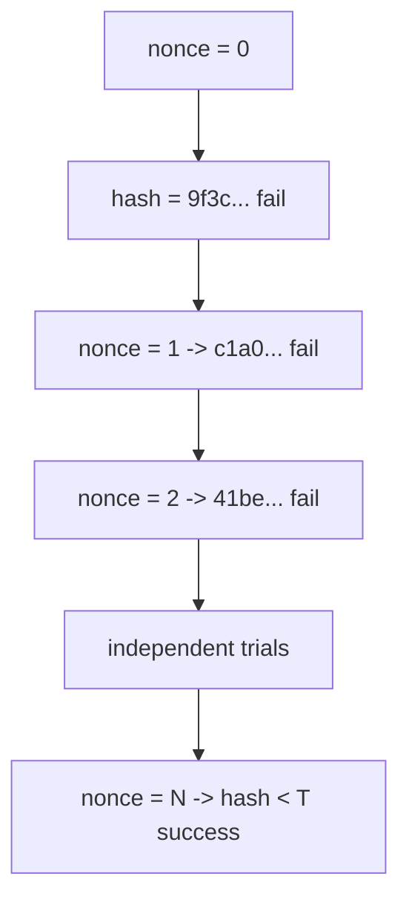
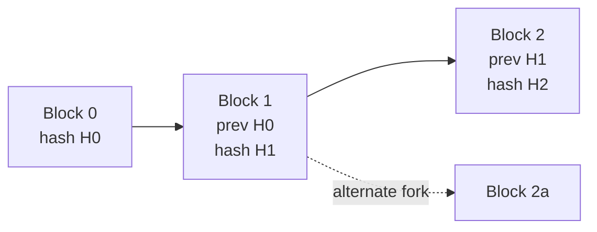

# 4 · Proof of Work — who appends, and why history is costly to rewrite

> [!info] Navigation
> [[🏠 Home]] · prev → [[3 - Digital Signatures]] · next → [[5 - Putting It Together]] · code → [[Block.cs]] · glossary → [[Glossary]]

## 0. One-sentence intuition

Proof of work makes block creation a public lottery where the ticket price is hashing cost and verification is one hash.

## 1. Problem being solved

If anyone can append blocks freely, an attacker can rewrite history at negligible cost. A permissionless chain needs a Sybil-resistant rule for choosing the next block producer. Proof of work uses scarce physical resources: computation, electricity, hardware, and time.

The consensus rule is not "the first block someone claims." It is:

$$
\text{accept valid blocks and extend the valid chain with greatest cumulative work.}
$$

"Longest chain" is a useful slogan only when all blocks have comparable difficulty. The precise rule is most accumulated work.

## 2. Formal target model

Interpret the block-header hash as a 256-bit integer. A block is valid iff

$$
\operatorname{int}(H(header)) < T,
$$

where $T$ is the current target.

For uniformly distributed hash outputs,

$$
p=\Pr[\operatorname{int}(H(header))<T]=\frac{T}{2^{256}}.
$$

If the target corresponds to requiring $k$ leading zero bits in a toy model, then

$$
p=2^{-k},\qquad \mathbb E[X]=2^k.
$$

Bitcoin does not literally store "number of leading zero bits" as the consensus target. It stores a compact encoding called `nBits`, which expands to a 256-bit target threshold.

### Difficulty

Bitcoin-style difficulty is normalized against a maximum target $T_0$:

$$
D=\frac{T_0}{T}.
$$

Smaller target means lower success probability and higher difficulty.

## 3. Mining distribution

Each nonce/header attempt is a Bernoulli trial with success probability $p=T/2^{256}$. The number of attempts until success is geometric:

$$
X\sim \operatorname{Geometric}(p).
$$

Therefore

$$
\mathbb E[X]=\frac1p,
\qquad
\operatorname{Var}(X)=\frac{1-p}{p^2}.
$$

If the network hash rate is $h$ hashes per second, expected block time is

$$
\mathbb E[\tau]=\frac{1}{h p}
=\frac{1}{h\cdot T/2^{256}}.
$$

For constant $h$ and small $p$, block arrivals are well approximated by a Poisson process with rate

$$
\lambda=hp.
$$

The probability of $k$ blocks in time interval $t$ is

$$
\Pr[N(t)=k]=\frac{(\lambda t)^k e^{-\lambda t}}{k!}.
$$

This explains why real block intervals are noisy. Difficulty targets a mean, not a schedule.

## 4. Security assumptions and threat model

Adversary capabilities:

- Controls fraction $q$ of total hash rate.
- Can mine private forks.
- Can delay, reorder, or eclipse network messages depending on the network model.
- Can choose timestamps within permitted consensus limits.
- Can join or influence mining pools.

Adversary cannot, under the model:

- Evaluate the hash function faster than its hardware permits.
- Bias SHA-256 outputs away from uniformity.
- Violate the validity rules honest nodes enforce.
- Outpace honest miners indefinitely when $q<1/2$ and propagation assumptions are reasonable.

> [!danger] If this assumption fails
> If an attacker controls majority hash power, proof of work no longer prevents reorganization. If hash outputs are biased or predictable, mining is no longer a fair Bernoulli experiment. If network propagation fails, honest hash rate can be partitioned and wasted.

## 5. Theorem / proof sketch

### Mining is Bernoulli search

Assume $H(header)$ is uniform in $\{0,\ldots,2^{256}-1\}$ for every distinct nonce/header input. Then

$$
\Pr[H(header)<T]=\frac{|\{0,\ldots,T-1\}|}{2^{256}}=\frac{T}{2^{256}}.
$$

Changing the nonce gives a new trial. Under the random-oracle heuristic, these trials are independent. Thus nonce search is equivalent to independent Bernoulli trials.

### Memorylessness

For a geometric random variable $X$ counting trials until the first success,

$$
\Pr[X>s+t\mid X>s]
=\frac{(1-p)^{s+t}}{(1-p)^s}
=(1-p)^t
=\Pr[X>t].
$$

A miner who has already tried one billion nonces is not "due" for a block. Past failures do not improve the next hash.

### Confirmation depth from asymptotic catch-up risk

For attacker hash fraction $q$ and honest fraction $p_h=1-q$ with $q<p_h$, the simplified gambler's-ruin approximation is

$$
\Pr[\text{catch up from }z\text{ blocks behind}]\approx\left(\frac{q}{p_h}\right)^z.
$$

To make this less than a risk threshold $\epsilon$,

$$
\left(\frac{q}{p_h}\right)^z < \epsilon
$$

so

$$
z > \frac{\ln \epsilon}{\ln(q/p_h)}.
$$

Because $q/p_h<1$, the denominator is negative and the inequality direction is handled by the logarithm expression above.

## 6. Nakamoto double-spend probability

The whitepaper refines the simple $(q/p_h)^z$ expression by accounting for the attacker's private blocks mined while the honest network gets $z$ confirmations. Let

$$
\lambda=z\frac{q}{p_h}.
$$

If the attacker has mined $k$ private blocks while the honest chain advanced $z$, then the remaining deficit is $z-k$. The probability is approximated by

$$
P(z,q)=1-
\sum_{k=0}^{z}
\frac{\lambda^k e^{-\lambda}}{k!}
\left(1-\left(\frac{q}{p_h}\right)^{z-k}\right).
$$

This is still a model, not a law of nature. Real risk also depends on network propagation, exchange policy, mempool behavior, transaction value, and whether the attacker can eclipse specific victims.

## 7. Difficulty retargeting

Bitcoin retargets periodically. The pedagogical formula is

$$
T_{new}=T_{old}\cdot \frac{actual\_time}{expected\_time}.
$$

If blocks were too fast, $actual\_time<expected\_time$ and the target decreases, raising difficulty. If blocks were too slow, the target increases. Production systems clamp adjustments to prevent extreme jumps.

MiniChain uses a fixed leading-zero difficulty, so it demonstrates the distribution but not the feedback controller.

## 8. Forks and cumulative work

Two miners can find valid blocks at nearly the same height. Nodes may temporarily see different tips:

```text
          B2a
         /
B0 -> B1
         \
          B2b -> B3b
```

The branch with greater cumulative work becomes canonical. Transactions in the losing branch return to the mempool if still valid. This is why proof-of-work finality is probabilistic: deeper confirmations reduce reorganization probability but do not make it mathematically zero.

## 9. Worked numerical example

For MiniChain difficulty $k=16$ leading zero bits,

$$
p=2^{-16}=\frac{1}{65,536}.
$$

Therefore

$$
\mathbb E[X]=65,536.
$$

Observed demo output:

```text
Block 1 mined: nonce=60023
Block 2 mined: nonce=72916
```

Both are in the right order of magnitude. One block being faster or slower than the mean is normal because the geometric distribution has high variance.

## 10. ASCII diagrams

```text
Hash target model

0                                                         2^256 - 1
|---------------- valid ----------------|---------------- invalid -----------|
0                                      T

A block is valid iff:

    integer(SHA256(header)) < T
```

```text
Mining as Bernoulli trials

nonce=0   -> hash = 9f3c...     fail
nonce=1   -> hash = c1a0...     fail
nonce=2   -> hash = 41be...     fail
...
nonce=N   -> hash = 0000...     success

Each trial succeeds with probability p = T / 2^256.
Expected trials = 1/p.
```

```text
Fork resolution

          B2a
         /
B0 -> B1
         \
          B2b -> B3b

Temporary fork at height 2.
After B3b, the lower branch has more accumulated work.
Nodes converge to B0 -> B1 -> B2b -> B3b.
```

## 11. Mermaid diagram





## 12. C# implementation link

MiniChain's mining loop is the geometric experiment:

```csharp
public long Mine()
{
    ComputeMerkleRoot();
    long tries = 0;
    while (true)
    {
        tries++;
        var h = HeaderHash();
        if (Crypto.LeadingZeroBits(h) >= Difficulty)
        {
            Hash = Crypto.ToHex(h);
            return tries;
        }
        Nonce++;
    }
}
```

Full file: [[Block.cs]]. Chain validation appears in [[5 - Putting It Together]].

## 13. Edge cases and attacks

| Attack | Mechanism | What assumption it stresses |
|---|---|---|
| 51% attack | Majority hash power reorganizes or censors. | Honest majority. |
| Selfish mining | Private block withholding to waste honest work. | Network propagation and miner incentives. |
| Block withholding | Pool participant submits shares but hides valid blocks. | Pool trust model. |
| Eclipse attack | Victim sees attacker-controlled peers. | Network diversity. |
| Timestamp manipulation | Miners choose allowed timestamps strategically. | Retarget and time-window rules. |
| Difficulty manipulation | Exploit retarget formula or hashrate oscillation. | Adjustment robustness. |
| Pool centralization | Control concentrates in few coordinators. | Decentralized block production. |

### Energy economics

A miner's expected operating equation is

$$
\operatorname{profit}=\operatorname{revenue}-\operatorname{electricity}-\operatorname{hardware\ depreciation}-\operatorname{operating\ cost}.
$$

Revenue is

$$
\operatorname{revenue}=\operatorname{block\ subsidy}+\operatorname{fees}.
$$

The chain's ongoing security budget is roughly the same quantity paid to miners:

$$
\operatorname{security\ budget}\approx \operatorname{block\ subsidy}+\operatorname{transaction\ fees}.
$$

When subsidy declines, long-run proof-of-work security increasingly depends on fees and market willingness to pay for settlement.

## 14. What MiniChain simplifies

MiniChain correctly shows nonce grinding, geometric expected trials, and hash-link tamper detection. It omits:

- compact `nBits` target encoding;
- cumulative-work fork choice;
- difficulty retargeting;
- timestamps with median-time-past constraints;
- block propagation and orphan/stale rates;
- selfish mining and eclipse resistance;
- mempool fee selection;
- mining pools and payout schemes;
- subsidy halvings and fee markets.

## 15. References

- Satoshi Nakamoto, *Bitcoin: A Peer-to-Peer Electronic Cash System*, 2008.
- Adam Back, *Hashcash - A Denial of Service Counter-Measure*, 2002.
- Bitcoin Developer Reference, block header target and `nBits` compact format.
- Ittay Eyal and Emin Gun Sirer, *Majority is not Enough: Bitcoin Mining is Vulnerable*, 2014.
- Juan Garay, Aggelos Kiayias, and Nikos Leonardos, *The Bitcoin Backbone Protocol*, 2015.
