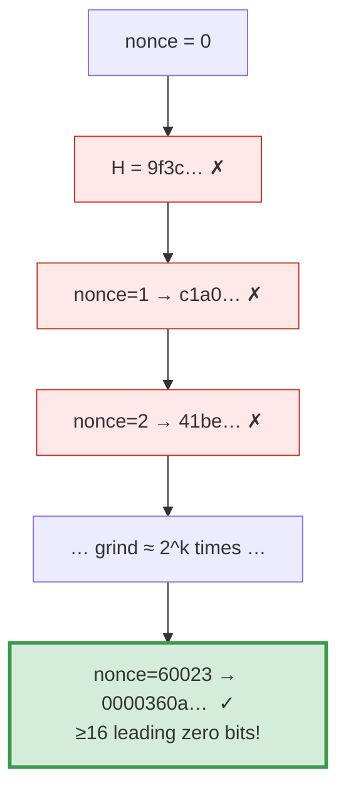
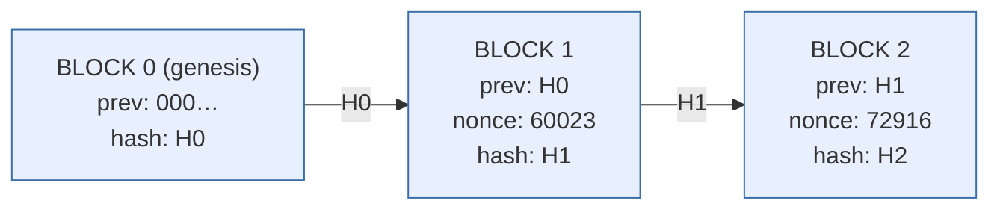

# 4 · Proof of Work — who appends, and why history is immutable

> [!info] Navigation
> [[🏠 Home]] · prev → [[3 - Digital Signatures]] · next → [[5 - Putting It Together]] · code → [[Block.cs]]

## The math — a probability problem

If anyone can append freely, an attacker just rewrites history. Bitcoin makes
appending a **random search that costs energy**. A block is valid only if its
header hash, read as a 256-bit integer, is below a **target** $T$:

$$
H(\text{header}) < T \quad\Longleftrightarrow\quad H(\text{header})\ \text{has} \ge k \ \text{leading zero bits}
$$

Since a good hash is uniform over $[0, 2^{256})$, one random nonce succeeds with
probability

$$
\Pr[\text{success}] = \frac{T}{2^{256}} = 2^{-k}
$$

The number of tries $X$ until the first success is **geometric**, so

$$
\mathbb{E}[X] = \frac{1}{\Pr[\text{success}]} = 2^{k}
$$

> [!note] That's the whole game
> $k$ leading zero bits ⇒ about $2^{k}$ hashes on average. Difficulty retargets
> by moving $T$ so blocks arrive every ~10 minutes as network hash-rate changes.

### Why this makes history immutable

Each header commits to the previous block's hash. To alter block $i$ you must
re-mine $i$ **and every block after it**, faster than the honest network extends
the tip. If honest miners hold $>50\%$ of hash-rate, the probability an attacker
$z$ blocks behind ever catches up **decays exponentially in $z$** (Nakamoto's
gambler's-ruin result) — which is why exchanges wait "6 confirmations."

$$
\Pr[\text{attacker catches up from } z \text{ behind}] \sim \left(\frac{q}{p}\right)^{z}, \quad q < p
$$

## Visual — the nonce search

The miner varies one field (`nonce`) and re-hashes until the output lands in the
tiny valid zone:



```
   hash space  [0 ─────────────────────────────────── 2²⁵⁶)
                │valid│░░░░░░░░░░░░░░░░░░░░░░░░░░░░░░░░░░░░░░░
                └─ < T ┘   this sliver has probability 2^(−k)
```

## Visual — the hash-link that makes tampering cascade



> [!danger] Tamper with a tx in Block 1
> Its [[2 - Merkle Trees|Merkle root]] changes → `H1` changes → Block 2's `prev`
> no longer equals `H1` → the link is broken. The attacker must re-mine Block 1
> **and** Block 2 **and** every later block, out-pacing the honest network.
> Probability of success $\downarrow e^{-z}$.

## The C# — the mining loop *is* the geometric experiment

```csharp
public long Mine()
{
    ComputeMerkleRoot();
    long tries = 0;
    while (true)
    {
        tries++;
        var h = HeaderHash();                            // SHA-256 of the header
        if (Crypto.LeadingZeroBits(h) >= Difficulty)     // landed below target?
        {
            Hash = Crypto.ToHex(h);
            return tries;                                // expected ≈ 2^Difficulty
        }
        Nonce++;                                         // vary the one free field
    }
}
```

> [!example] Theory vs. reality
> With `Difficulty = 16`, theory predicts $\mathbb{E}[X] = 2^{16} = 65{,}536$ tries.
> MiniChain mined block 1 at nonce **60,023** and block 2 at nonce **72,916** —
> both within the expected order of magnitude. The probability formula and the
> running program agree.

Full file: [[Block.cs]]. How validation catches tampering: [[5 - Putting It Together]].
