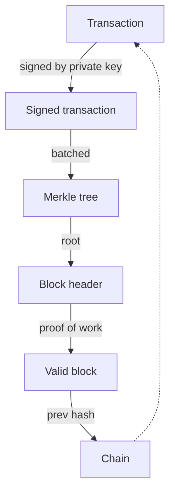

# 5 · Putting It Together

> [!info] Navigation
> [[🏠 Home]] · prev → [[4 - Proof of Work]] · next → [[6 - Further Topics]] · code → [[Blockchain.cs]] · glossary → [[Glossary]]

## 0. One-sentence intuition

A blockchain is a replicated state machine whose history is ordered by consensus and whose state transitions are authorized by signatures.

## 1. Problem being solved

The four primitives solve different subproblems:

| Primitive | Question answered |
|---|---|
| [[1 - Hash Functions]] | Did these bytes change? |
| [[2 - Merkle Trees]] | Is this transaction committed in this block? |
| [[3 - Digital Signatures]] | Did the owner authorize this transaction? |
| [[4 - Proof of Work]] | Which valid history should nodes extend? |

Together they define an append-only, adversarially replicated log of state transitions.

## 2. Formal state-transition model

Let $S_t$ be global state before block $B_t$. A blockchain is a deterministic state machine:

$$
S_{t+1}=\delta(S_t,B_t).
$$

All honest full nodes must compute the same $S_{t+1}$ from the same $S_t$ and $B_t$. This requires deterministic transaction ordering, canonical serialization, and consensus-exact arithmetic.

For an account model,

$$
state[address]=(balance,nonce,storageRoot,codeHash)
$$

in the Ethereum-style general case. A simple payment-only account model can be reduced to

$$
state[address]=(balance,nonce).
$$

A transaction is valid if

$$
Valid(tx,S)=
\begin{cases}
true & \text{signature valid}\land nonce(sender)=tx.nonce\land balance(sender)\ge amount+fee,\\
false & \text{otherwise.}
\end{cases}
$$

Applying a payment transaction updates balances and the sender nonce:

$$
balance(sender)'=balance(sender)-amount-fee,
$$

$$
balance(recipient)'=balance(recipient)+amount,
$$

$$
nonce(sender)'=nonce(sender)+1.
$$

## 3. Full block validity

A block is valid only if all consensus checks pass. A realistic checklist is:

1. Previous-hash pointer equals the parent block hash.
2. Timestamp is acceptable under consensus rules.
3. Proof-of-work target is satisfied.
4. Difficulty/target value is correct for the height.
5. Merkle root matches the ordered transaction list.
6. Transaction syntax and canonical encodings are valid.
7. Each transaction signature verifies under the correct signing scope.
8. Each transaction is valid under sequential state transition.
9. No double spend or nonce replay occurs.
10. Coinbase/subsidy/reward does not exceed allowed issuance plus fees.
11. Block size, weight, gas, or execution limits are respected.
12. The resulting state root or UTXO set transition is correct, if the chain commits to one.

MiniChain currently checks Merkle root, proof of work, and previous-hash linkage. It demonstrates structural tamper detection, not complete economic validity.

## 4. Account model versus UTXO model

### Account model

The account model stores balances and nonces directly:

$$
S[a]=(balance_a,nonce_a,storageRoot_a,codeHash_a).
$$

Double-spend prevention is mostly nonce-based: a sender's transactions must use consecutive nonces. It is convenient for smart contracts because contract storage is naturally attached to accounts.

### UTXO model

The UTXO model stores spendable coin objects:

$$
UTXO=\{(txid,index,value,scriptPubKey)\}.
$$

A transaction consumes previous unspent outputs and creates new outputs:

$$
Inputs\subseteq UTXO,
\qquad
Outputs=\{(value_i,script_i)\}_i.
$$

Validity requires that each input exists, is not already spent, satisfies its locking script, and that

$$
\sum inputs \ge \sum outputs.
$$

The difference is not cosmetic. UTXO systems have natural parallelism and explicit coin provenance. Account systems simplify global state and contract programming but require nonce management and careful state access control.

## 5. Security assumptions and threat model

Adversary capabilities:

- Can submit valid or invalid transactions.
- Can reorder transactions inside blocks it produces.
- Can withhold blocks or mine forks if it has hash power.
- Can exploit wallet signing mistakes and mempool policy differences.
- Can attempt hash collisions, signature forgeries, or consensus serialization splits.

Adversary cannot, under the model:

- Forge signatures without private keys.
- Break collision resistance of committed hashes.
- Outwork the honest network when it has minority hash rate under normal network assumptions.
- Make deterministic full nodes compute different state from identical bytes.

> [!danger] If this assumption fails
> If signature unforgeability fails, ownership collapses. If Merkle binding fails, block contents become equivocal. If proof-of-work majority assumptions fail, history can be rewritten. If state transition determinism fails, consensus splits.

## 6. Theorem / proof sketch

### Full tamper-detection theorem

Given a valid chain

$$
C=[B_0,\ldots,B_n],
$$

modifying any transaction in block $B_i$ invalidates the chain unless the adversary does at least one of the following:

1. finds a hash collision inside the Merkle tree;
2. finds a hash collision in the block-header hash;
3. recomputes valid proof of work for $B_i,B_{i+1},\ldots,B_n$ and overtakes the honest chain.

Proof sketch. Modifying a transaction changes its transaction hash unless there is a transaction-hash collision. That changes the Merkle root unless there is a Merkle-tree collision. The Merkle root is committed inside the block header, so the header hash changes unless there is a header collision. The next block stores the old header hash as its previous pointer, so linkage breaks. Repairing linkage requires changing all descendant headers, which invalidates their proof of work. The attacker must therefore redo the work and win fork choice.

### Supply invariant for account balances

Assume every non-coinbase transaction satisfies

$$
balance(sender)\ge amount+fee,
$$

and applies conservation

$$
\Delta balance(sender)+\Delta balance(recipient)+fee=0.
$$

Assume coinbase issuance in block $t$ is bounded by allowed subsidy plus fees:

$$
coinbase_t\le subsidy_t+fees_t.
$$

Then total supply changes only by allowed issuance:

$$
Supply_{t+1}-Supply_t\le subsidy_t.
$$

Proof sketch. Sum balance deltas over all accounts. Ordinary transfers telescope to zero except fees. Fees are destroyed from senders but reintroduced through coinbase. The only net new value is bounded subsidy. Therefore inflation beyond the issuance schedule requires violating transaction validity or coinbase validity.

## 7. Worked example

MiniChain's validation loop:

```csharp
public (bool ok, string? reason) IsValid()
{
    for (int i = 0; i < Chain.Count; i++)
    {
        var b = Chain[i];
        var expectedRoot = MerkleTree.Root(b.Transactions.Select(t => t.TxId).ToList());
        if (b.Transactions.Count > 0 && b.MerkleRoot != expectedRoot)
            return (false, $"Block {i}: Merkle root mismatch (tx tampered).");
        if (!b.HasValidProofOfWork())
            return (false, $"Block {i}: proof-of-work invalid.");
        if (i > 0 && b.PreviousHash != Chain[i - 1].Hash)
            return (false, $"Block {i}: broken link to previous block.");
    }
    return (true, null);
}
```

This maps directly to the structural pillars:

- Merkle root check: hash commitments and transaction inclusion.
- Proof-of-work check: append cost.
- Previous-hash check: chain linkage.

It does not yet check balances, double spends, nonce sequencing, fee accounting, coinbase inflation, or fork choice.

## 8. ASCII diagram

```text
Blockchain pipeline

[Transaction]
     |
     | signed by private key
     v
[Signed transaction]
     |
     | grouped with other txs
     v
[Merkle tree]
     |
     | root committed into header
     v
[Block header]
     |
     | proof-of-work search
     v
[Valid block]
     |
     | prev hash links to next block
     v
[Chain]
```

```text
Validation mirror

For each block:

1. Check transaction signatures
2. Recompute transaction IDs
3. Recompute Merkle root
4. Check stored Merkle root
5. Check PoW target
6. Check previous-hash pointer
7. Apply transactions to state
8. Reject if any state invariant breaks
```

## 9. Mermaid diagram



## 10. C# implementation link

Full file: [[Blockchain.cs]]. The code is intentionally small enough to inspect in one sitting. That is useful pedagogically but should not be mistaken for production consensus logic.

## 11. Edge cases and attacks

### Fork choice

Nodes should choose

$$
bestChain=\arg\max_{chain}\ cumulativeWork(chain).
$$

The valid chain with most accumulated work wins. Height alone is not sufficient when difficulty changes.

### Mempool policy

A mempool is not consensus. It is local policy for unconfirmed transactions. Typical policies include:

- signature and syntax prechecks;
- fee-rate ordering;
- replacement rules;
- ancestor/descendant limits;
- orphan transaction handling;
- spam controls;
- eviction under memory pressure.

Different nodes can have different mempools without disagreeing on consensus.

### Finality

- **Proof-of-work finality:** probabilistic; reorg probability falls with confirmations.
- **Proof-of-stake economic finality:** reverting finalized blocks requires slashable stake or social recovery, depending on protocol.
- **BFT deterministic finality:** once a quorum commits, finality is immediate under the protocol assumptions, usually with known validator sets and synchrony assumptions.

### Production validation beyond MiniChain

Real chains must handle script or VM execution, fee markets, gas/weight limits, state commitments, database persistence, peer-to-peer propagation, denial-of-service limits, and consensus upgrades.

## 12. What MiniChain simplifies

MiniChain omits:

- networking and peer discovery;
- fork-choice storage;
- cumulative-work accounting;
- dynamic difficulty retargeting;
- transaction fees and mempool policy;
- UTXO set or full account nonces;
- coinbase maturity and exact issuance schedule;
- persistent database and crash consistency;
- adversarial serialization tests;
- script or VM execution;
- state roots and fraud/witness proofs;
- wallet UX and hardware signing constraints.

## 13. References

- Satoshi Nakamoto, *Bitcoin: A Peer-to-Peer Electronic Cash System*, 2008.
- Ethereum Yellow Paper, state-transition and account model.
- Bitcoin Developer Reference, block chain and transaction validation references.
- Garay, Kiayias, and Leonardos, *The Bitcoin Backbone Protocol*, 2015.
- Buterin and Griffith, *Casper the Friendly Finality Gadget*, 2017.
