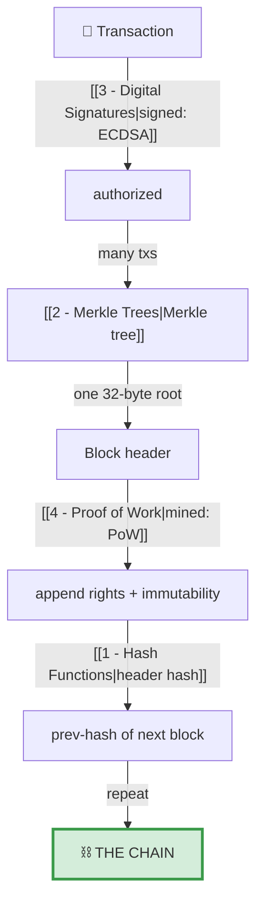

# 5 · Putting It Together

> [!info] Navigation
> [[🏠 Home]] · prev → [[4 - Proof of Work]] · next → [[6 - Further Topics]] · code → [[Blockchain.cs]]

## How the four pieces compose



> [!summary] Remove any one and it stops being a blockchain
> - No **hashing** → no linking, no tamper-evidence.
> - No **Merkle** → can't prove inclusion cheaply.
> - No **signatures** → anyone spends anyone's coins.
> - No **PoW** (or equivalent like Proof-of-Stake) → no agreement on the one true history.

## Full validation is the mirror of the theory

```csharp
public (bool ok, string? reason) IsValid()
{
    for (int i = 0; i < Chain.Count; i++)
    {
        var b = Chain[i];
        // (a) transactions still hash to the committed Merkle root
        var expectedRoot = MerkleTree.Root(b.Transactions.Select(t => t.TxId).ToList());
        if (b.Transactions.Count > 0 && b.MerkleRoot != expectedRoot)
            return (false, $"Block {i}: Merkle root mismatch (tx tampered).");
        // (b) the proof-of-work actually holds for the stored hash
        if (!b.HasValidProofOfWork())
            return (false, $"Block {i}: proof-of-work invalid.");
        // (c) the hash-link to the previous block is intact
        if (i > 0 && b.PreviousHash != Chain[i - 1].Hash)
            return (false, $"Block {i}: broken link to previous block.");
    }
    return (true, null);
}
```

Each check maps to a pillar: (a) → [[1 - Hash Functions]] + [[2 - Merkle Trees]], (b) → [[4 - Proof of Work]], (c) → the hash-link.

> [!example] Verified tamper test
> MiniChain rewrites an amount to `9999` in block 2 *without* re-mining:
> ```
> Chain valid before tampering: True
> Chain valid after tampering:  False  ->  Block 2: Merkle root mismatch (tx tampered).
> ```
> Caught immediately at check (a) — the changed transaction no longer hashes to
> the root the header committed to.

## The whole demo, end to end

```
=== 4. MINING + CHAIN ===
Genesis mined. Difficulty = 16 leading zero bits.
Block 1 mined: nonce=60023, hash=0000360a094c18f326d3…
Block 2 mined: nonce=72916, hash=0000e3cb3b72ab387084…
Alice balance = 90   Bob balance = 10
```

See [[MiniChain Overview]] to run it yourself.
