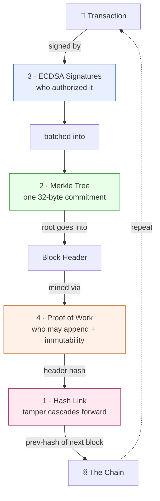

# 🏠 Blockchain Math — Home

> [!abstract] What this vault is
> A visual, math-first tour of how a blockchain actually works. Every concept is
> taught three ways: **the pure math** (MathJax equations), **a diagram**
> (Mermaid, renders as a real graphic), and **the C#** that implements it —
> verified to compile and run.

## The one-sentence definition

> [!quote]
> A blockchain is a **hash-linked list of batches of signed messages, where
> appending is made deliberately expensive so that rewriting history is
> computationally infeasible.**

Four pieces of math carry the whole thing. Click through in order:

## The four pillars

| # | Concept | Math that carries it | The question it answers |
|---|---------|----------------------|--------------------------|
| 1 | [[1 - Hash Functions]] | one-wayness + avalanche | *is the data untampered?* |
| 2 | [[2 - Merkle Trees]] | binary hash tree, $O(\log N)$ proofs | *is this tx in the block?* |
| 3 | [[3 - Digital Signatures]] | elliptic-curve discrete log | *who authorized this?* |
| 4 | [[4 - Proof of Work]] | geometric distribution of trials | *who gets to append?* |

Then see how they compose: [[5 - Putting It Together]].

## The code

The running example is a verified mini-blockchain, **MiniChain**:

- [[MiniChain Overview]] — how to build & run it
- Source, one file per pillar: [[Crypto.cs]] · [[MerkleTree.cs]] · [[Wallet.cs]] · [[Block.cs]] · [[Blockchain.cs]]

> [!tip] Turn on the good stuff
> Open **Graph View** (the connected-dots icon in the left ribbon) to *see* how
> the concepts link. Mermaid diagrams and MathJax equations render automatically
> in Reading/Live-Preview mode.

## Where to go next
[[6 - Further Topics]] — UTXO vs. accounts, Proof-of-Stake, secp256k1, Schnorr/BLS.
